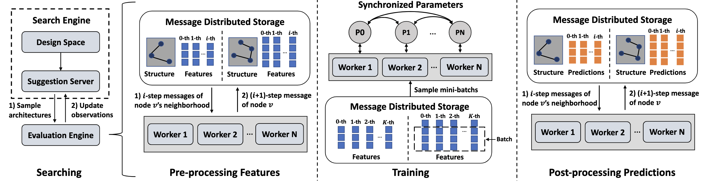

# Awesome-Auto-GNNs

## Contents
- [AutoML on Graphs](#AutoML)
  - [Graph Neural Architecture Search](#GNAS)
  - [Graph Hyper-Parameter Optimization](#GHPO)
  - [Survey](#AutoML-survey)
  - [Tool](#AutoML-Tool)

This part refers to [[awesome-auto-graph-learning]](https://github.com/THUMNLab/awesome-auto-graph-learning) and adds some new works.    

<a name="GNAS" />

## Graph Neural Architecture Search

    
     
    <em>Source: PaSca: a Graph Neural Architecture Search System under the Scalable Paradigm</em>

### 2022

1. **PaSca a Graph Neural Architecture Search System under the Scalable Paradigm** [WWW 2022] [[paper]](https://arxiv.org/abs/2203.00638) [[code]](https://github.com/PKU-DAIR/SGL)
2. **Designing the Topology of Graph Neural Networks A Novel Feature Fusion Perspective** [WWW 2022] [[paper]](https://arxiv.org/abs/2112.14531) 
3. **AutoHEnsGNN Winning Solution to AutoGraph Challenge for KDD Cup 2020** [ICDE 2022] [[paper]](https://arxiv.org/abs/2111.12952) [[code]](https://github.com/aister2020/KDDCUP_2020_AutoGraph_1st_Place)
4. **Auto-GNAS: A Parallel Graph Neural Architecture Search Framework** [TPDS 2022] [[paper]](https://ieeexplore.ieee.org/document/9714826) [[code]](https://github.com/AutoMachine0/Auto-GNAS)
5. **Profiling the Design Space for Graph Neural Networks based Collaborative Filtering** [WSDM 2022] [[paper]](http://www.shichuan.org/doc/125.pdf) [[code]](https://github.com/BUPT-GAMMA/Design-Space-for-GNN-based-CF)

### 2021

1. **Graph Differentiable Architecture Search with Structure Learning** [NeurIPS 2021] [[paper]](https://openreview.net/forum?id=kSv_AMdehh3) [[code]](https://github.com/THUMNLab/AutoGL)
2. **AutoGEL: An Automated Graph Neural Network with Explicit Link Information** [NeurIPS 2021] [[paper]](https://openreview.net/forum?id=PftCCiHVQP) [[code]](https://github.com/zwangeo/AutoGEL)
3. **Heterogeneous Graph Neural Architecture Search** [ICDM 2021] [[paper]](https://ieeexplore.ieee.org/document/9679011) 
4. **Automated Graph Representation Learning for Node Classification** [IJCNN 2021] [[paper]](https://ieeexplore.ieee.org/document/9533811) 
5. **ALGNN Auto-Designed Lightweight Graph Neural Network** [PRICAI 2021] [[paper]](https://link.springer.com/chapter/10.1007/978-3-030-89188-6_37) 
6. **Pooling Architecture Search for Graph Classification** [CIKM 2021] [[paper]](https://arxiv.org/abs/2108.10587) [[code]](https://github.com/AutoML-Research/PAS)
7. **DiffMG Differentiable Meta Graph Search for Heterogeneous Graph Neural Networks** [KDD 2021] [[paper]](https://arxiv.org/abs/2010.03250) [[code]](https://github.com/AutoML-4Paradigm/DiffMG)
8. **Learn Layer-wise Connections in Graph Neural Networks** [KDD 2021 DLG Workshop] [[paper]](https://arxiv.org/abs/2112.13585) 
9. **AutoAttend Automated Attention Representation Search** [ICML 2021] [[paper]](http://proceedings.mlr.press/v139/guan21a/guan21a.pdf) [[code]](https://github.com/THUMNLab/AutoAttend)
10. **GraphPAS Parallel Architecture Search for Graph Neural Networks** [SIGIR 2021] [[paper]](https://dl.acm.org/doi/abs/10.1145/3404835.3463007)
11. **Rethinking Graph Neural Network Search from Message-passing** [CVPR 2021] [[paper]](https://arxiv.org/abs/2103.14282) [[code]](https://github.com/phython96/GNAS-MP)
12. **Fitness Landscape Analysis of Graph Neural Network Architecture Search Spaces** [GECCO 2021] [[paper]](https://dl.acm.org/doi/10.1145/3449639.3459318) [[code]](https://github.com/mhnnunes/fla_nas_gnn)
13. **Learned low precision graph neural networks** [EuroSys 2021 EuroMLSys workshop] [[paper]](https://arxiv.org/abs/2009.09232) 
14. **Autostg: Neural architecture search for predictions of spatio-temporal graphs** [WWW 2021] [[paper]](https://zhangjunbo.org/pdf/2021_WWW_AutoSTG.pdf) [[code]](https://github.com/panzheyi/AutoSTG)
15. **Search to aggregate neighborhood for graph neural network** [ICDE 2021] [[paper]](https://arxiv.org/abs/2104.06608) [[code]](https://github.com/AutoML-4Paradigm/SANE)
16. **One-shot graph neural architecture search with dynamic search space** [AAAI 2021] [[paper]](https://www.aaai.org/AAAI21Papers/AAAI-3441.LiY.pdf) 
17. **Search For Deep Graph Neural Networks** [Arxiv 2021] [[paper]](https://arxiv.org/abs/2109.10047)
18. **G-CoS GNN-Accelerator Co-Search Towards Both Better Accuracy and Efficiency** [ICCAD 2021] [[paper]](https://arxiv.org/abs/2109.08983) 
19. **Edge-featured Graph Neural Architecture Search** [Arxiv 2021] [[paper]](https://arxiv.org/abs/2109.01356)
20. **FL-AGCNS: Federated Learning Framework for Automatic Graph Convolutional Network Search** [Arxiv 2021] [[paper]](https://arxiv.org/abs/2104.04141) [[code]](https://github.com/1173710224/FL-AGCNS)

### 2020

1. **Graph Neural Architecture Search** [IJCAI 2020] [[paper]](https://www.ijcai.org/proceedings/2020/195) [[code]](https://github.com/GraphNAS/GraphNAS)
2. **Design space for graph neural networks** [NeurIPS 2020] [[paper]](https://arxiv.org/abs/2011.08843) [[code]](https://github.com/snap-stanford/GraphGym)
3. **Autograph: Automated graph neural network** [ICONIP 2020] [[paper]](https://arxiv.org/abs/2011.11288) 
4. **Graph neural network architecture search for molecular property prediction** [BigData 2020] [[paper]](https://arxiv.org/abs/2008.12187) [[code]](https://github.com/0oshowero0/GEMS)
5. **Genetic Meta-Structure Search for Recommendation on Heterogeneous Information Network** [CIKM 2020] [[paper]](https://arxiv.org/abs/2102.10550) [[code]](https://github.com/0oshowero0/GEMS)
6. **Simplifying architecture search for graph neural network** [CIKM 2020 CSSA workshop] [[paper]](https://arxiv.org/abs/2008.11652) [[code]](https://github.com/AutoML-4Paradigm/SNAG)
7. **Neural architecture search in graph neural networks** [BRACIS 2020] [[paper]](https://arxiv.org/abs/2008.00077) [[code]](https://github.com/mhnnunes/nas_gnn)
8. **SGAS: Sequential Greedy Architecture Search** [CVPR 2020] [[paper]](https://arxiv.org/abs/1912.00195) [[code]](https://github.com/lightaime/sgas)
9. **Learning graph convolutional network for skeleton-based human action recognition by neural searching** [AAAI 2020] [[paper]](https://arxiv.org/abs/1911.04131) [[code]](https://github.com/xiaoiker/GCN-NAS)
10. **Efficient graph neural architecture search** [OpenReview 2020] [[paper]](https://openreview.net/forum?id=IjIzIOkK2D6) 
11. **Evolutionary architecture search for graph neural networks** [Arxiv 2020] [[paper]](https://arxiv.org/abs/2009.10199) [[code]](https://github.com/IRES-FAU/Evolutionary-Architecture-Search-for-Graph-Neural-Networks)
12. **Probabilistic dual network architecture search on graphs** [Arxiv 2020] [[paper]](https://arxiv.org/abs/2003.09676) 

### 2019

1. **Auto-GNN: Neural Architecture Search of Graph Neural Networks** [Arxiv 2019] [[paper]](https://arxiv.org/abs/1909.03184) 

<a name="GHPO" />

## Graph Hyper-Parameter Optimization

    
     
    <em>Source: AutoNE: Hyperparameter optimization for massive network embedding</em>

### 2021

1. **Explainable Automated Graph Representation Learning with Hyperparameter Importance** [ICML 2021] [[paper]](http://proceedings.mlr.press/v139/wang21f/wang21f.pdf)
2. **Automated Graph Learning via Population Based Self-Tuning GCN** [SIGIR 2021] [[paper]](https://arxiv.org/abs/2107.04713)
3. **Automatic Graph Learning with Evolutionary Algorithms: An Experimental Study** [PRICAI 2021] [[paper]](https://link.springer.com/chapter/10.1007/978-3-030-89188-6_38)
4. **Which Hyperparameters to Optimise? An Investigation of Evolutionary Hyperparameter Optimisation in Graph Neural Network For Molecular Property Prediction** [GECCO 2021] [[paper]](https://arxiv.org/abs/2104.06046)
5. **ASFGNN Automated separated-federated graph neural network** [P2PNA 2021] [[paper]](https://arxiv.org/abs/2011.03248)
6. **A novel genetic algorithm with hierarchical evaluation strategy for hyperparameter optimisation of graph neural networks** [Arxiv 2021] [[paper]](https://arxiv.org/abs/2101.09300)
7. **Jitune: Just-in-time hyperparameter tuning for network embedding algorithms** [Arxiv 2021] [[paper]](https://arxiv.org/abs/2101.06427)

### 2020

1. **Autonomous graph mining algorithm search with best speed/accuracy trade-off** [ICDM 2020] [[paper]](https://arxiv.org/abs/2011.14925) [[code]](https://github.com/minjiyoon/ICDM20-AutoGM)

### 2019

1. **AutoNE: Hyperparameter optimization for massive network embedding** [KDD 2019] [[paper]](http://pengcui.thumedialab.com/papers/AutoNE.pdf) [[code]](https://github.com/minjiyoon/ICDM20-AutoGM)

<a name="AutoML-survey" />

## Survey

1. **Automated Machine Learning on Graphs: A Survey** [IJCAI 2021] [[paper]](https://arxiv.org/abs/2103.00742)
2. **Graph Neural Networks: AutoML** [Springer 2022][[paper](https://link.springer.com/chapter/10.1007/978-981-16-6054-2_17)]

<a name="AutoML-Tool" />

## Tool
1. **PaSca a Graph Neural Architecture Search System under the Scalable Paradigm** [WWW 2022] [[paper]](https://arxiv.org/abs/2203.00638) [[code]](https://github.com/PKU-DAIR/SGL)[[doc]](sgl-doc.readthedocs.io/en/latest)

2. **AutoGL: A Library for Automated Graph Learning** [ICLR 2021 GTRL workshop] [[paper]](https://openreview.net/pdf?id=0yHwpLeInDn) [[code]](https://github.com/THUMNLab/AutoGL) [[homepage]](https://mn.cs.tsinghua.edu.cn/AutoGL)
