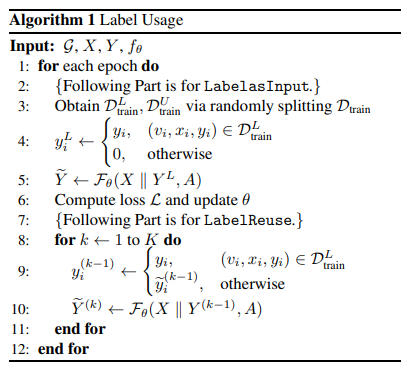
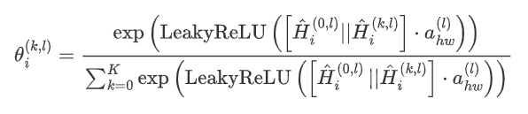
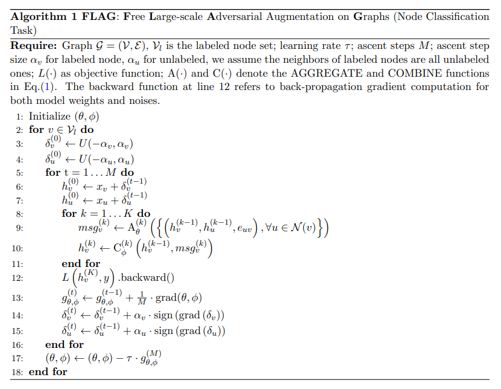
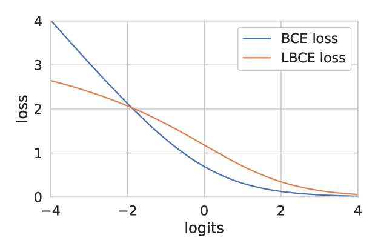

# Tricks of GNNs

## Simple Graph Augmentation

- **Label Usage**
  
  
  
  - **Label Input**
    - In each epoch, randomly split the training set into two sub-datasets  and 
    - For nodes in  , concatenate their label information with the original features
  - **Label Reuse**
    - Similar to label propagation algorithm. In each iteration, assign the output soft labels to the nodes which didn’t have true labels
    - Enable the model to update the predicted labels through iterations, but not limited by the homophily assumption
  - **Optimized Label Reuse**
    - The reliability of the output soft labels is not guaranteed in the first few epochs, therefore **Label Reuse** may not be effective in these occasions 
    - Optimal optimization includes setting threshold, only exploiting the output soft labels at later stages in training, etc.
  - [Ref_code](https://github.com/Espylapiza/dgl/tree/master/examples/pytorch/ogb/ogbn-arxiv)

- **Label embedding and propagation**
  
  - Used in node prediction task. Get matrix  through label propagation on training set labels. Apply linear transformation to  and add the result to the original features to create the new features
    
    
  
  - [Paddle_code](https://github.com/PaddlePaddle/PGL/tree/main/ogb_examples/nodeproppred/unimp)

- **Virtual Nodes**
  
  - Used in graph classification task. Add several virtual nodes ( such as 3 ) to the original training set, and all nodes are connected to these virtual nodes. Their features are the average of the remaining node features.
  - [Paddle_code](https://github.com/PaddlePaddle/PGL/tree/main/ogb_examples/nodeproppred/ogbn-arxiv/unimp_appnp_vnode_smooth)

## Model Architecture Design

- **Transition matrix normalization for GAT**
  
  - Normalize the transition matrix of GAT
    
    
  
  - [Ref_code](https://github.com/Espylapiza/dgl/tree/master/examples/pytorch/ogb/ogbn-arxiv)

- **Correct and Smooth**
  
  - Smoothen errors in **Correct** steps and smoothen labels in **Smooth** steps
  - [C&S_code](https://github.com/CUAI/CorrectAndSmooth)

- **Hop-wise attention (AGDN)**
  
  - In each layer of the model, the information of different scales is calculated by , where  is the transformation matrix of GAT
  
  - When the attention weight of each node is calculated on the information of different scales,  is used as benchmark: 
    
    
  
  - [AGDN_code](https://github.com/skepsun/adaptive_graph_diffusion_networks_with_hop-wise_attention)

- **Residual term**
  
  - Add residual terms to each layer of the model
    
    
    
    where  is the transformation of GCN or GAT
  
  - [Ref Code](https://github.com/skepsun/adaptive_graph_diffusion_networks_with_hop-wise_attention)

- **Self Knowledge Distillation**
  
  - Firstly train a pretrained teacher model, and then use logits of the teacher model and ground truth labels to train a student model with KD loss and CE loss
  - The architecture of the student model is the same as teacher model
  - [Self-KD-code](https://github.com/ShunliRen/dgl/tree/master/examples/pytorch/ogb/ogbn-arxiv)

- **APPNP-like Propagation (UniMP)** 
  
  - Add the node features and labels vectors together as propagation information 
  
  - Apply APPNP-like propagation to the combined message, where the transformation matrix can be attention matrix of GAT or Graph Transformer

      
  
  - [UniMP_code](https://github.com/PaddlePaddle/PGL/tree/main/ogb_examples/nodeproppred/unimp)

## Training Tricks

- **Masked label prediction** 
  
  - In each epoch, randomly mask labels of some nodes in training set and only make use of the label information of the unmasked nodes for training
  - This trick can be combined with tricks in **Simple Graph Augmentation** part
  - [Paddle_code](https://github.com/PaddlePaddle/PGL/tree/main/ogb_examples/nodeproppred/unimp)

- **FLAG**
  
  - Add a gradient-based perturbation to the feature during training to achieve data enhancement and alleviate overfit
    
    
  
  - [FLAG_code](https://github.com/devnkong/FLAG)

## Loss Function Modification

- **A More Robust Cross Entropy Loss**
  
  - Replace the binary cross entropy loss with LCE loss, which can be written as 
    
    
    
    where  is a hyperparameter.
  
  - Comparison with BCE loss and LBCE loss, where 
    
    
  
  - [Ref_code](https://github.com/Espylapiza/dgl/tree/master/examples/pytorch/ogb/ogbn-arxiv)

- **Topology Loss**
  
  - Randomly sample a portion of edges and maximize the sum of cosine similarity of the two endpoint embeddings of the edges
    
    
  
  - [Topo Loss code](https://github.com/mengyangniu/dgl/tree/master/examples/pytorch/ogb/ogbn-arxiv)
