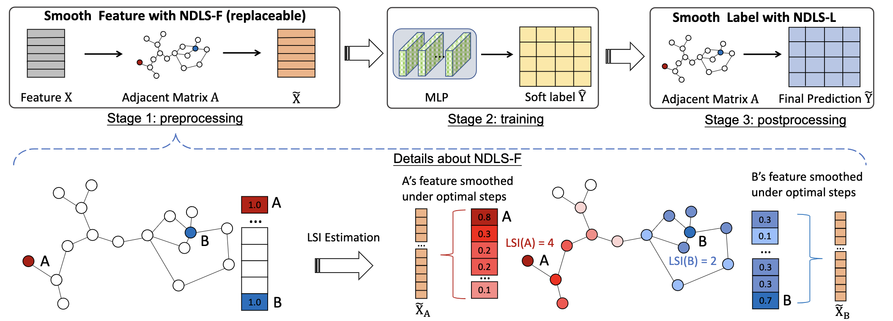
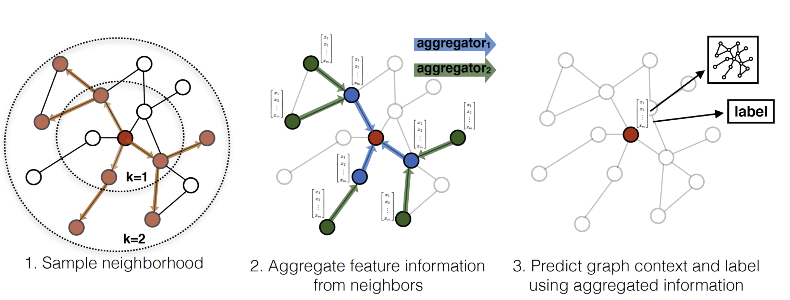

# Awsome-Scalable-GNNs

## Contents
- [Scalable-GNNs](#Scalable-GNN)
  - [1.Linear Model](#Linear-Model)
  - [2.Sampling](#Sampling)

<a name="Scalable-GNN" />

To scale GNNs to extremely large graphs, existing works can be classified into the following two types.

<a name="Linear-Model" />

## 1.Linear Model

    
     
    <em>Source: Node Dependent Local Smoothing for Scalable Graph Learning</em>

1. **Simplifying Graph Convolutional Networks** [ICML 2019] [[paper]](https://arxiv.org/abs/1902.07153) [[code]](https://github.com/Tiiiger/SGC)
2. **Scalable Graph Neural Networks via Bidirectional Propagation** [NeurIPS 2020] [[paper]](https://arxiv.org/abs/2010.15421) [[code]](https://github.com/chennnM/GBP)
3. **SIGN: Scalable Inception Graph Neural Networks** [ICML 2020] [[paper]](https://arxiv.org/abs/2004.11198) [[code]](https://github.com/twitter-research/sign)
4. **Simple Spectral Graph Convolution** [ICLR 2021] [[paper]](https://openreview.net/forum?id=CYO5T-YjWZV) [[code]](https://github.com/allenhaozhu/SSGC)
5. **Node Dependent Local Smoothing for Scalable Graph Learning** [NeurIPS 2021] [[paper]](https://arxiv.org/abs/2110.14377) [[code]](https://github.com/zwt233/NDLS)
6. **Scalable and Adaptive Graph Neural Networks with Self-Label-Enhanced training** [Arxiv 2021] [[paper]](https://arxiv.org/abs/2104.09376) [[code]](https://github.com/skepsun/SAGN_with_SLE)
7. **Graph Attention Multi-Layer Perceptron** [Arxiv 2021] [[paper]](https://arxiv.org/abs/2108.10097) [[code]](https://github.com/zwt233/GAMLP)
7. **NAFS: A Simple yet Tough-to-Beat Baseline for Graph Representation Learning** [OpenReview 2022] [[paper]](https://openreview.net/forum?id=dHJtoaE3yRP) [[code]](https://openreview.net/attachment?id=dHJtoaE3yRP&name=supplementary_material)

<a name="Sampling" />

## 2.Sampling

    
     
    <em>Source: Inductive Representation Learning on Large Graphs</em>

### Node-wise sampling

1. **Inductive Representation Learning on Large Graphs** [NIPS 2017] [[paper]](https://arxiv.org/abs/1706.02216) [[code]](https://github.com/twjiang/graphSAGE-pytorch)
2. **Scaling Graph Neural Networks with Approximate PageRank** [KDD 2020] [[paper]](https://arxiv.org/abs/2007.01570) [[code]](https://github.com/TUM-DAML/pprgo_pytorch)
3. **Stochastic Training of Graph Convolutional Networks with Variance Reduction** [ICML 2018] [[paper]](https://arxiv.org/abs/1710.10568) [[code]](https://github.com/thu-ml/stochastic_gcn)
4. **GNNAutoScale: Scalable and Expressive Graph Neural Networks via Historical Embeddings** [ICML 2021] [[paper]](https://arxiv.org/abs/2106.05609) [[code]](https://github.com/rusty1s/pyg_autoscale)
5. **Graph Convolutional Neural Networks for Web-Scale Recommender Systems** [KDD 2018] [[paper]](https://arxiv.org/abs/1806.01973)

### Layer-wise sampling

1. **FastGCN: Fast Learning with Graph Convolutional Networks via Importance Sampling** [ICLR 2018]  [[paper]](https://arxiv.org/abs/1801.10247)[[code]](https://github.com/matenure/FastGCN)
2. **Accelerating Large Scale Real-Time GNN Inference using Channel Pruning** [Arxiv 2021] [[paper]](https://arxiv.org/abs/2105.04528) [[code]](https://github.com/tedzhouhk/GCNP)
3. **Adaptive Sampling Towards Fast Graph Representation Learning** [NeurIPS 2018] [[paper]](https://arxiv.org/abs/1809.05343) [[code_pytorch]](https://github.com/dmlc/dgl/tree/master/examples/pytorch/_deprecated/adaptive_sampling) [[code_tentsor_flow]](https://github.com/huangwb/AS-GCN)

### Graph-wise sampling

1. **Cluster-GCN: An Efficient Algorithm for Training Deep and Large Graph Convolutional Networks** [KDD 2019] [[paper]](https://arxiv.org/abs/1905.07953) [[code]](https://github.com/google-research/google-research/tree/master/cluster_gcn)
2. **GraphSAINT: Graph Sampling Based Inductive Learning Method** [ICLR 2020] [[paper]](https://arxiv.org/abs/1907.04931) [[code]](https://github.com/GraphSAINT/GraphSAINT)
3. **Large-Scale Learnable Graph Convolutional Networks** [KDD 2018] [[paper]](https://dl.acm.org/doi/abs/10.1145/3219819.3219947) [[code]](https://github.com/divelab/lgcn)
